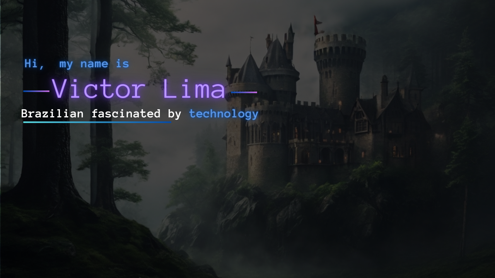

  

 

<h1 font-weight="bold" align="center">
Welcome to my profile!.
 

#

👋🏽 Autodidata em busca constante de conhecimento para expandir horizontes e evoluir diariamente.

🌊 Nascido e criado na baixada caiçara, tenho uma paixão intrínseca pelas ondas e a tecnologia já faz parte integrante do meu dia a dia.

 📚 Desenvolvimento web, comunicação e planejamento são o foco do meu trabalho.

 💻 Busco constantemente colaborar em projetos que me proporcionem experiência, buscando não apenas contribuir, mas também participar de conversas profundas que possam enriquecer meu conhecimento em diversas áreas. 

 
  
  
  
  
  
  
  
  
  
  
  

